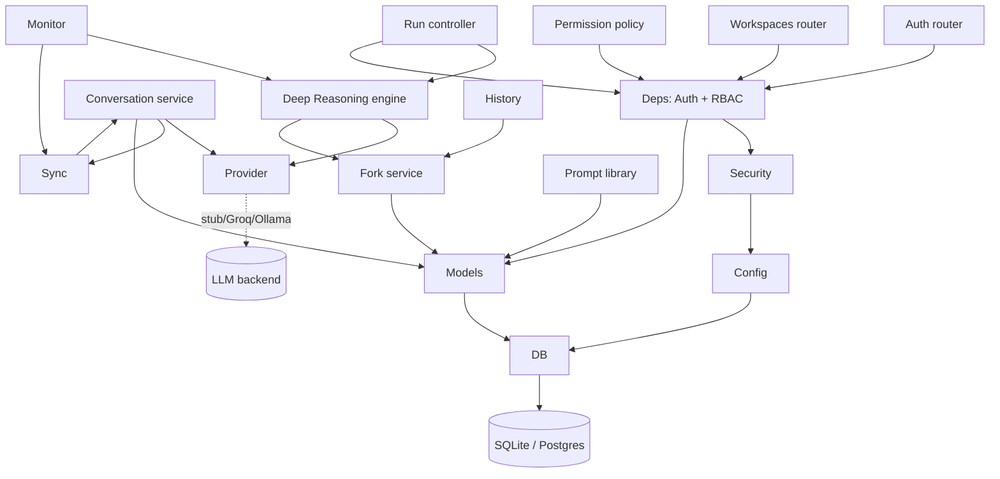
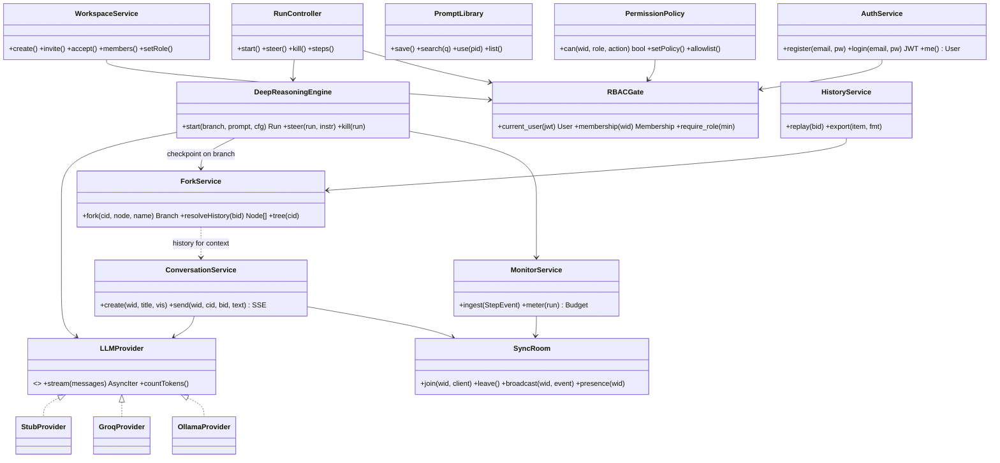
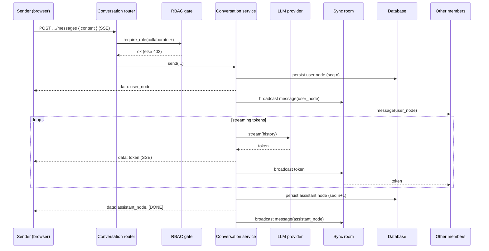
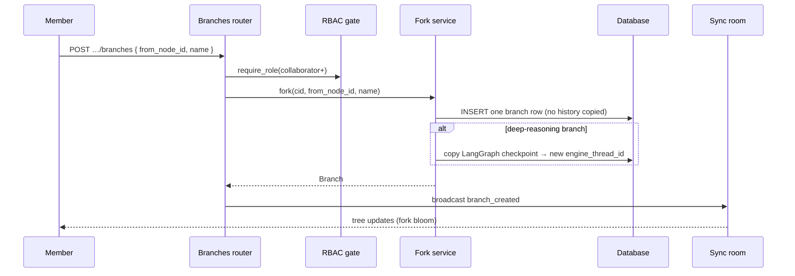
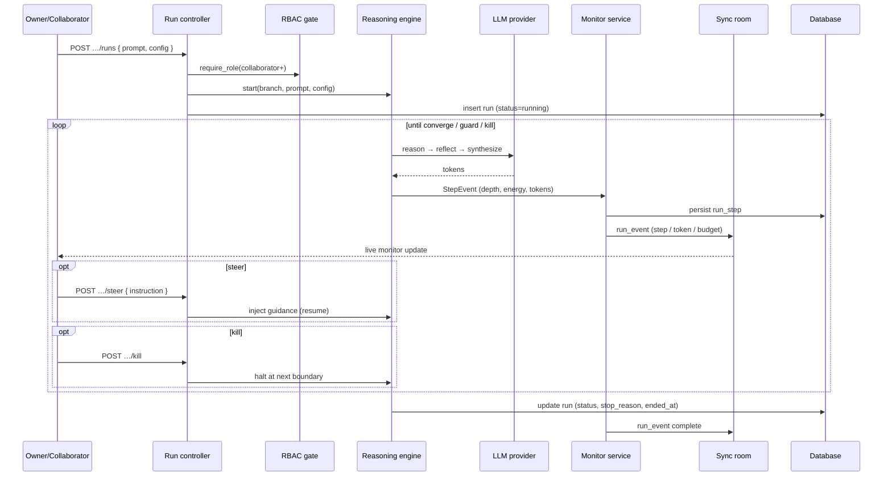

# Helix — Design Phase


# Part 2 — Database Design

## 1. Design Goals

The schema is shaped by five forces specific to Helix, and every later decision traces
back to one of them:

1. **Strict multi-tenancy.** A *workspace* is the tenant boundary. Every row that holds
   team data carries a `workspace_id`, and no query may ever return another tenant's
   data. Isolation is enforced both in application code and, on the production database,
   by Row-Level Security.
2. **Append-only, server-ordered conversations.** Messages are immutable *nodes* stamped
   with a monotonic sequence number. There are no in-place edits, which gives one
   authoritative order and makes real-time fan-out and replay trivially consistent.
3. **Structural branching (cheap forks).** A fork must not copy history. Branches are
   pointers into a shared tree of nodes, so forking is constant-time regardless of
   conversation length — the database models lineage, not duplication.
4. **Policy as data.** Role permissions live in a `permissions` table, not in code, so an
   Owner can retune what each role may do without a redeployment.
5. **Polyglot persistence.** The same schema runs on **SQLite** for zero-infrastructure
   development and **PostgreSQL** for production, so types and constraints are chosen to
   be portable across both.

## 2. Logical Data Model (ERD)

```mermaid
erDiagram
    USERS ||--o{ MEMBERSHIPS : has
    WORKSPACES ||--o{ MEMBERSHIPS : contains
    WORKSPACES ||--o{ INVITES : issues
    WORKSPACES ||--o{ CONVERSATIONS : owns
    WORKSPACES ||--o{ PROMPTS : owns
    WORKSPACES ||--o{ PERMISSIONS : defines
    WORKSPACES ||--o{ RUNS : hosts
    CONVERSATIONS ||--o{ BRANCHES : has
    CONVERSATIONS ||--o{ RUNS : escalates
    BRANCHES ||--o{ NODES : groups
    BRANCHES ||--o{ BRANCHES : forked_from
    NODES ||--o{ NODES : parent_of
    RUNS ||--o{ RUN_STEPS : emits

    USERS { uuid id PK
        string email UK
        string pw_hash
        timestamp created_at }
    WORKSPACES { uuid id PK
        string name
        uuid owner_id FK
        timestamp created_at }
    MEMBERSHIPS { uuid id PK
        uuid user_id FK
        uuid workspace_id FK
        string role
        timestamp joined_at }
    INVITES { string token PK
        uuid workspace_id FK
        uuid created_by FK
        string role
        timestamp expires_at
        timestamp created_at }
    CONVERSATIONS { uuid id PK
        uuid workspace_id FK
        uuid author_id FK
        string title
        string visibility
        uuid default_branch_id
        timestamp created_at }
    BRANCHES { uuid id PK
        uuid conversation_id FK
        string name
        uuid parent_branch_id FK
        uuid fork_node_id
        uuid head_node_id
        string engine_thread_id
        timestamp created_at }
    NODES { uuid id PK
        uuid branch_id FK
        uuid parent_id FK
        int seq
        uuid author_id FK
        string role
        json content
        int token_count
        timestamp created_at }
    PROMPTS { uuid id PK
        uuid workspace_id FK
        uuid author_id FK
        string title
        text body
        json tags
        int used_count
        timestamp created_at }
    RUNS { uuid id PK
        uuid workspace_id FK
        uuid conversation_id FK
        uuid branch_id FK
        string status
        string provider
        string model
        string stop_reason
        timestamp started_at
        timestamp ended_at }
    RUN_STEPS { uuid id PK
        uuid run_id FK
        int idx
        string node
        json payload
        int token_count
        int latency_ms
        timestamp created_at }
    PERMISSIONS { uuid workspace_id PK_FK
        string role PK
        string action PK
        bool allowed }
```

## 3. Entity Catalogue

Types are written portably. On PostgreSQL: `UUID` is native, `timestamp` is
`TIMESTAMPTZ`, `json` is `JSONB`. On SQLite (dev): `UUID` and `timestamp` are stored as
`TEXT` (36-char UUID string, ISO-8601 UTC), `json` as `TEXT`. Enumerations are modelled
as `VARCHAR` + a `CHECK` constraint (portable; SQLite has no native enum).

### 3.1 `users`
The account. Credentials are hashed, never stored in clear.

| Column | Type | Constraints | Description |
|---|---|---|---|
| `id` | UUID | PK | Server-generated identity |
| `email` | VARCHAR(255) | UNIQUE, NOT NULL | Login identifier; case-insensitive match |
| `pw_hash` | VARCHAR(255) | NOT NULL | bcrypt hash of the password |
| `created_at` | timestamp | NOT NULL, default now | Registration time |

**Indexes:** unique on `email`.

### 3.2 `workspaces`
The tenant. The creator becomes its Owner.

| Column | Type | Constraints | Description |
|---|---|---|---|
| `id` | UUID | PK | Tenant boundary key (appears on all owned rows) |
| `name` | VARCHAR(120) | NOT NULL | Display name |
| `owner_id` | UUID | FK → `users.id`, NOT NULL | The founding Owner |
| `created_at` | timestamp | NOT NULL, default now | Creation time |

### 3.3 `memberships`
User-↔-workspace association carrying the role. The join table that powers RBAC and
tenant access.

| Column | Type | Constraints | Description |
|---|---|---|---|
| `id` | UUID | PK | Surrogate identity |
| `user_id` | UUID | FK → `users.id`, NOT NULL | Member |
| `workspace_id` | UUID | FK → `workspaces.id`, NOT NULL | Tenant |
| `role` | VARCHAR(16) | NOT NULL, CHECK ∈ {`owner`,`collaborator`,`observer`} | Authorisation role |
| `joined_at` | timestamp | NOT NULL, default now | When they joined |

**Keys:** surrogate PK `id` with a UNIQUE constraint on (`user_id`,`workspace_id`) — a user
holds at most one role per workspace. **Indexes:** `(workspace_id)` for member lists,
`(user_id)` for "my workspaces".

### 3.4 `invites`
Onboarding tokens. The token *is* the primary key — an opaque, unguessable secret.

| Column | Type | Constraints | Description |
|---|---|---|---|
| `token` | VARCHAR(64) | PK | Opaque random invite secret (the link) |
| `workspace_id` | UUID | FK → `workspaces.id`, NOT NULL | Target workspace |
| `created_by` | UUID | FK → `users.id`, NOT NULL | The Owner who issued the invite |
| `role` | VARCHAR(16) | NOT NULL, default `collaborator` | Role granted on accept |
| `expires_at` | timestamp | NOT NULL | Validity horizon (default +7 days) |
| `created_at` | timestamp | NOT NULL, default now | Issued at |

**Indexes:** `(workspace_id)`. Expiry is enforced on read (a token past `expires_at` is
treated as not found). Datetimes are normalised to UTC on read so SQLite's naive
timestamps compare safely against an aware "now".

### 3.5 `conversations`
A thread within a workspace, shared or private.

| Column | Type | Constraints | Description |
|---|---|---|---|
| `id` | UUID | PK | Conversation identity |
| `workspace_id` | UUID | FK → `workspaces.id`, NOT NULL | Tenant scope |
| `author_id` | UUID | FK → `users.id`, NOT NULL | Creator (the only viewer if private) |
| `title` | VARCHAR(200) | NOT NULL | Display title |
| `visibility` | VARCHAR(8) | NOT NULL, CHECK ∈ {`shared`,`private`} | Access mode |
| `default_branch_id` | UUID | FK → `branches.id` (deferrable) | The root branch (created with the conversation) |
| `created_at` | timestamp | NOT NULL, default now | Creation time |

**Indexes:** `(workspace_id, visibility)` for the workspace conversation list,
`(author_id)` for private-thread lookups. `default_branch_id` is a deliberate
denormalisation (avoids a lookup for the entry branch); its FK is deferrable because the
conversation and its root branch are created in one transaction.

### 3.6 `branches`
A line in the conversation tree. **This is the table that makes forks O(1):** a branch
is a *pointer*, not a copy.

| Column | Type | Constraints | Description |
|---|---|---|---|
| `id` | UUID | PK | Branch identity |
| `conversation_id` | UUID | FK → `conversations.id`, NOT NULL | Owning conversation |
| `name` | VARCHAR(120) | NOT NULL | Branch label (e.g. `chunk-v2`) |
| `parent_branch_id` | UUID | FK → `branches.id`, NULL for root | Lineage link |
| `fork_node_id` | UUID | FK → `nodes.id`, NULL for root | The node this branch diverged at |
| `head_node_id` | UUID | FK → `nodes.id`, NULL until first message | Cached tip of the branch |
| `engine_thread_id` | VARCHAR(64) | NULL | LangGraph checkpoint id — set only for Deep-Reasoning branches |
| `created_at` | timestamp | NOT NULL, default now | Creation time |

**Indexes:** `(conversation_id)` to assemble the tree, `(parent_branch_id)` to find
children. `head_node_id` is denormalised so reading the tip never scans for `MAX(seq)`;
`engine_thread_id` being non-null marks a branch as reasoning-bearing.

### 3.7 `nodes`
The append-only message units. A node is immutable once written. History is a tree:
`parent_id` is the spine, `seq` orders siblings within a branch.

| Column | Type | Constraints | Description |
|---|---|---|---|
| `id` | UUID | PK | Node identity |
| `branch_id` | UUID | FK → `branches.id`, NOT NULL | Branch the node was written on |
| `parent_id` | UUID | FK → `nodes.id`, NULL at root | Previous node — the fork spine (may cross branch boundaries) |
| `seq` | INTEGER | NOT NULL | Monotonic order within `branch_id` |
| `author_id` | UUID | FK → `users.id`, NULL for assistant/system | Who sent it |
| `role` | VARCHAR(10) | NOT NULL, CHECK ∈ {`user`,`assistant`,`system`} | Message role |
| `content` | json | NOT NULL | Message payload (text + any structured parts) |
| `token_count` | INTEGER | NOT NULL, default 0 | Cached token size (budgeting/metrics) |
| `created_at` | timestamp | NOT NULL, default now | Write time |

**Keys/indexes:** UNIQUE `(branch_id, seq)` guarantees one authoritative order per
branch; `(parent_id)` powers the history walk. Immutability + `seq` is what lets the
real-time layer fan out safely without operational transforms.

### 3.8 `prompts`
The shared, searchable prompt library.

| Column | Type | Constraints | Description |
|---|---|---|---|
| `id` | UUID | PK | Prompt identity |
| `workspace_id` | UUID | FK → `workspaces.id`, NOT NULL | Tenant scope |
| `author_id` | UUID | FK → `users.id`, NOT NULL | Who saved it |
| `title` | VARCHAR(200) | NOT NULL | Short label |
| `body` | TEXT | NOT NULL | The prompt text |
| `tags` | json | NOT NULL, default `[]` | String tag array |
| `used_count` | INTEGER | NOT NULL, default 0 | Times inserted — the "what works" signal |
| `created_at` | timestamp | NOT NULL, default now | Saved at |

**Indexes:** `(workspace_id)`; on Postgres a GIN index over `to_tsvector(title‖body)` for
search and a GIN index on `tags`. `used_count` is a denormalised counter surfaced in the
library UI.

### 3.9 `runs`
A Deep-Reasoning escalation of a branch. Tracks lifecycle and provenance.

| Column | Type | Constraints | Description |
|---|---|---|---|
| `id` | UUID | PK | Run identity |
| `workspace_id` | UUID | FK → `workspaces.id`, NOT NULL | Tenant scope |
| `conversation_id` | UUID | FK → `conversations.id`, NOT NULL | Source conversation |
| `branch_id` | UUID | FK → `branches.id`, NOT NULL | Branch being reasoned on |
| `status` | VARCHAR(10) | NOT NULL, CHECK ∈ {`running`,`paused`,`done`,`killed`,`error`} | Lifecycle state |
| `provider` | VARCHAR(16) | NOT NULL | LLM backend used (`groq`/`ollama`/`stub`) |
| `model` | VARCHAR(64) | NULL | Concrete model name |
| `stop_reason` | VARCHAR(32) | NULL | Why it halted (`converged`/`budget`/`killed`/…) |
| `started_at` | timestamp | NOT NULL, default now | Start |
| `ended_at` | timestamp | NULL | End (null while live) |

**Indexes:** `(workspace_id)`, `(branch_id)`, `(status)` to find live runs.

### 3.10 `run_steps`
The persisted reasoning trace — one row per engine transition. Drives both the live
monitor and later replay.

| Column | Type | Constraints | Description |
|---|---|---|---|
| `id` | UUID | PK | Step identity |
| `run_id` | UUID | FK → `runs.id`, NOT NULL | Owning run |
| `idx` | INTEGER | NOT NULL | Ordinal within the run |
| `node` | VARCHAR(24) | NOT NULL | Engine node (`reason`/`reflect`/`synthesize`/…) |
| `payload` | json | NOT NULL | Step event (thought, energy, depth, readings, synthesis) |
| `token_count` | INTEGER | NOT NULL, default 0 | Tokens used this step |
| `latency_ms` | INTEGER | NOT NULL, default 0 | Step duration |
| `created_at` | timestamp | NOT NULL, default now | Emitted at |

**Keys/indexes:** UNIQUE `(run_id, idx)` — ordered, gap-free trace for deterministic
replay.

### 3.11 `permissions`
RBAC as **data**: the per-workspace, per-role, per-action policy. Seeded from the
default matrix (Section 12) and editable by an Owner.

| Column | Type | Constraints | Description |
|---|---|---|---|
| `workspace_id` | UUID | PK (composite), FK → `workspaces.id` | Tenant scope |
| `role` | VARCHAR(16) | PK (composite), CHECK ∈ {`owner`,`collaborator`,`observer`} | Role |
| `action` | VARCHAR(40) | PK (composite) | Action key (e.g. `message.send`, `run.kill`) |
| `allowed` | BOOLEAN | NOT NULL | Whether the role may perform the action |

**Keys:** composite PK (`workspace_id`,`role`,`action`).

## 4. Relationships & Cardinality

| Relationship | Cardinality | Meaning |
|---|---|---|
| users ↔ workspaces | many-to-many *via* `memberships` | A user joins many workspaces; each holds many members |
| workspace → conversations / prompts / runs / permissions / invites | one-to-many | Everything a team owns is tenant-scoped |
| conversation → branches | one-to-many | A thread has a root branch and any number of forks |
| branch → branch (`parent_branch_id`) | self-referential one-to-many | The fork lineage tree |
| branch → nodes | one-to-many | Messages written on that branch |
| node → node (`parent_id`) | self-referential one-to-many | The message spine, crossing branch boundaries |
| conversation → runs → run_steps | one-to-many-to-many | An escalation and its ordered trace |

## 5. Domains & Enumerations

Centralised value sets, each enforced by a `CHECK` (portable across SQLite/Postgres):

| Domain | Values |
|---|---|
| `role` | `owner` ⊃ `collaborator` ⊃ `observer` |
| `visibility` | `shared`, `private` |
| `node.role` | `user`, `assistant`, `system` |
| `run.status` | `running`, `paused`, `done`, `killed`, `error` |
| `run.stop_reason` | `converged`, `budget`, `depth_guard`, `loop_guard`, `killed`, `error` |
| `provider` | `stub`, `groq`, `ollama` |

## 6. Keys, Constraints & Referential Integrity

- **Primary keys** are UUID strings (server-generated) except `invites.token` (the secret
  itself) and the composite PK of `permissions`. `memberships` carries a surrogate `id`
  PK plus a UNIQUE(`user_id`,`workspace_id`).
- **Uniqueness:** `users.email`; `memberships(user_id, workspace_id)`;
  `nodes(branch_id, seq)`; `run_steps(run_id, idx)`.
- **Foreign keys** use `ON DELETE CASCADE` down ownership chains (deleting a workspace
  removes its conversations, branches, nodes, prompts, runs, steps, memberships,
  permissions, invites) and `ON DELETE SET NULL` for soft links (`nodes.author_id` when a
  user is removed but their messages remain).
- **Deferrable constraint:** `conversations.default_branch_id` ↔ `branches.conversation_id`
  is a mutual reference satisfied within the create-conversation transaction.
- **Not-null discipline:** every tenant row's `workspace_id` is NOT NULL — there is no such
  thing as an unscoped resource.

## 7. Indexing Strategy

| Table | Index | Purpose |
|---|---|---|
| `users` | unique(`email`) | Login |
| `memberships` | (`workspace_id`), (`user_id`) | Member lists / my-workspaces |
| `conversations` | (`workspace_id`,`visibility`), (`author_id`) | Listing & privacy filter |
| `branches` | (`conversation_id`), (`parent_branch_id`) | Tree assembly |
| `nodes` | unique(`branch_id`,`seq`), (`parent_id`) | Ordering + history walk |
| `prompts` | (`workspace_id`), GIN(tsvector), GIN(`tags`) | Search & tag filter (Postgres) |
| `runs` | (`workspace_id`), (`branch_id`), (`status`) | Live-run lookup |
| `run_steps` | unique(`run_id`,`idx`) | Ordered trace / replay |
| `invites` | (`workspace_id`) | Manage invites |

## 8. The Branch–Node Tree: Physical Model for O(1) Fork

The central data-structure decision. A conversation's history is a **tree of immutable
nodes**; a **branch** is a named pointer into that tree (a `fork_node_id` it diverged at
and a `head_node_id` tip). Forking therefore inserts **one** `branches` row and copies
**nothing** — it is constant-time no matter how long the conversation is. The cost moves
to the *read* path, which reconstructs a branch's history by walking `parent_id` from the
head back up through the spine, transparently crossing into the parent branch's nodes —
exactly Git's model of structural sharing. (The traversal algorithm itself is specified in
the Algorithm-Design part of this document.)

```
   main:     n1 ── n2 ── n3 ── n4(head)
                    │
                    └── fork here → branch "chunk-v2"
   chunk-v2:        (fork_node_id = n2) ── n5 ── n6(head)

   reading chunk-v2's history  =  walk n6 → n5 → n2 → n1   (root → head)
```

For a **Deep-Reasoning** fork, the server additionally copies the engine's LangGraph
checkpoint to a fresh `engine_thread_id` on the new branch, so the recursive state
continues independently; plain chat branches leave `engine_thread_id` null.

## 9. Multi-Tenant Isolation & Row-Level Security

Isolation is defence-in-depth, applied at two layers:

1. **Application layer.** Every query is filtered by the caller's `workspace_id`, resolved
   from their membership; a request touching a workspace the caller is not a member of is
   rejected before any row is read.
2. **Database layer (production Postgres).** Row-Level Security policies on every
   tenant-scoped table constrain access to the active workspace, set per request via a
   session variable:

   ```sql
   ALTER TABLE conversations ENABLE ROW LEVEL SECURITY;
   CREATE POLICY tenant_isolation ON conversations
     USING (workspace_id = current_setting('helix.workspace_id')::uuid);
   -- the request handler runs:  SET LOCAL helix.workspace_id = '<wid>';
   ```

   Even a coding mistake in a query cannot leak across tenants, because the database
   itself filters the rows. (SQLite dev relies on the application layer only; RLS is a
   production-Postgres feature.)

## 10. Visibility & Access at the Data Layer

Conversation `visibility` is enforced on every read, not just in the UI:

- **`shared`** — readable by any member of the workspace.
- **`private`** — readable only where `author_id` = the caller.

The effective read predicate for conversations is therefore:
`workspace_id = :wid AND (visibility = 'shared' OR author_id = :uid)`. Private threads are
invisible to everyone else by construction, independent of role.

## 11. Normalisation & Deliberate Denormalisation

The schema is **third normal form** — each non-key attribute depends on the whole key and
nothing else (e.g. a member's role lives on `memberships`, never duplicated onto messages;
prompt tags are their own JSON domain, not repeated columns). Four denormalisations are
kept on purpose, each a cached value with a clear maintainer:

| Cached field | Avoids | Kept correct by |
|---|---|---|
| `conversations.default_branch_id` | Looking up the root branch every open | Set once at creation |
| `branches.head_node_id` | `MAX(seq)` scan to find the tip | Updated on each append |
| `nodes.token_count` | Re-tokenising to budget/measure | Written at insert |
| `prompts.used_count` | Counting insert events | Incremented on insert-into-composer |

## 12. Seed Data — the RBAC Policy Matrix

On workspace creation, the `permissions` table is seeded from this default matrix (the
Owner may later edit it). `owner` ⊃ `collaborator` ⊃ `observer`.

| `action` | owner | collaborator | observer |
|---|:---:|:---:|:---:|
| `conversation.read` / `replay` | ✓ | ✓ | ✓ |
| `message.send` | ✓ | ✓ | ✗ |
| `branch.fork` | ✓ | ✓ | ✗ |
| `prompt.write` (save/edit) | ✓ | ✓ | ✗ |
| `run.escalate` (Deep Reasoning) | ✓ | ✓ | ✗ |
| `run.steer` / `run.kill` | ✓ | ✓ | ✗ |
| `member.invite` / `member.role` | ✓ | ✗ | ✗ |
| `permission.edit` | ✓ | ✗ | ✗ |

## 13. Polyglot Persistence & Migrations

One schema, two engines, via an async ORM (SQLAlchemy):

- **Development — SQLite.** A single local file, zero infrastructure. Tables are created
  on startup from the model metadata. UUIDs/timestamps are stored as text.
- **Production — PostgreSQL.** Native `UUID`, `TIMESTAMPTZ`, `JSONB`, GIN indexes, and
  Row-Level Security. Switched purely by the `DATABASE_URL` connection string — no code
  change.
- **Migrations.** Schema evolution is managed with Alembic (autogenerated, reviewed
  revisions) for production; the dev create-on-startup path is the convenience equivalent.
  Enumerations are `VARCHAR + CHECK` rather than native `ENUM` so the same DDL applies to
  both engines.

## 14. Data Lifecycle, Retention & Export

- **Append-only core.** Nodes and run-steps are never updated, only appended — the history
  is the source of truth and is inherently auditable.
- **Cascade on tenant deletion.** Removing a workspace cascades to all its owned rows; a
  member's removal detaches their memberships but preserves their authored nodes
  (`author_id → NULL`) so shared history stays intact.
- **Invite expiry.** Tokens are validated against `expires_at` on use; expired tokens are
  inert (and may be swept periodically).
- **Export.** Any conversation or run can be serialised to JSON (the canonical node/step
  shape) or Markdown for archival outside the system, satisfying the "kept artifact"
  requirement.

---

# Part 3 — Module Design

## 1. Architectural Overview

Helix is a three-tier application — a React client, a single FastAPI backend, and a
relational database — organised so that each kind of traffic uses the transport that
fits it, and each backend concern lives in its own module with one clear job.

**Transport split (deliberate).**

| Transport | Carries | Why this transport |
|---|---|---|
| **REST (JSON)** | All authoritative reads/writes: auth, workspaces, conversations, forks, prompts, run control | One ordered, idempotent, cacheable surface for state changes |
| **SSE (Server-Sent Events)** | The LLM token stream back to the *sender* | One-way, long-lived, simple — exactly a token stream |
| **WebSocket (one room per workspace)** | Presence + read-only broadcast of what already happened (messages, tokens, run events) to *other* members | Bidirectional liveness, but used as fan-out so the server keeps authoritative order |

The split means **sends and forks go through REST/SSE**, where the server stamps a
monotonic order, while the **WebSocket room is a pure broadcast channel**. This avoids
operational-transform/CRDT complexity while keeping a single, consistent shared log.

**Backend layering.** Requests flow inward through clearly separated layers:

```
HTTP / WS  →  Routers (transport, validation)
                 │
                 ├─ Dependencies: auth (JWT) → membership → RBAC gate
                 ▼
              Services (business logic: conversations, fork, library, monitor, history)
                 │
                 ├─ Provider interface (stub / Groq / Ollama)   — all inference
                 ├─ Sync layer (WebSocket rooms)                — all broadcast
                 ├─ Deep Reasoning engine (LangGraph, in-process)
                 ▼
              Models / ORM  →  Database (SQLite dev · Postgres prod)
```

## 2. Module Decomposition

Each module maps to a concrete place in the codebase. "Status" reflects what is built
versus designed.

| Module | Responsibility | Depends on | Location | Status |
|---|---|---|---|---|
| **Config** | Typed settings from env/`.env` (DB URL, JWT, provider, URLs) | — | `backend/api/config.py` | ✅ |
| **DB / Session** | Async engine, session-per-request, schema bootstrap, health ping | Config, Models | `backend/api/db.py` | ✅ |
| **Models** | ORM entities + small domain helpers (role rank, expiry, UTC normalise) | DB | `backend/api/models.py` | ✅ |
| **Security** | bcrypt hashing, JWT encode/decode | Config | `backend/api/security.py` | ✅ |
| **Errors** | Uniform `{ error: { code, message } }` shape | — | `backend/api/errors.py` | ✅ |
| **Deps (Auth + RBAC)** | `get_current_user`, `get_membership`, `require_role` gate | Security, Models, DB | `backend/api/deps.py` | ✅ |
| **Auth router** | Register, login, `/me` | Security, Deps, DB | `backend/api/routers/auth.py` | ✅ |
| **Workspaces router** | Workspaces, invites, members, role patch | Deps (RBAC), DB | `backend/api/routers/workspaces.py` | ✅ |
| **Provider layer** | One streaming `LLMProvider` interface; stub/Groq/Ollama backends; `get_provider()` selector | Config | `backend/api/providers/*` | ✅ |
| **Conversation service** | Create conversations, persist user/assistant nodes, drive the SSE send | Provider, Sync, Models | `routers/conversations.py` (M2) | ◻ designed |
| **Fork service** | O(1) fork; resolve history across branch boundaries; branch tree | Models | `services/fork.py` (M4) | ◻ designed |
| **Sync / WS rooms** | One in-memory room per workspace; presence; broadcast; per-client queues | Conversation, Engine | `ws/room.py` (M3) | ◻ designed |
| **Prompt library** | Save/search/tag prompts; usage counter | Models | `routers/prompts.py` (M5) | ◻ designed |
| **Deep Reasoning engine** | Recursive reason→reflect→synthesize loop; checkpointing; step/token events | Provider | `backend/engine/*` (M6) | ◻ designed |
| **Monitor service** | Normalise engine events; meter tokens/rate vs thresholds | Engine, Sync | `services/monitor.py` (M7) | ◻ designed |
| **Run controller** | Start/steer/kill; depth & loop guards; RBAC-gated | Engine, Deps, Models | `routers/runs.py` (M7) | ◻ designed |
| **History service** | Replay a branch; export JSON/Markdown | Fork, Models | `routers/history.py` (M8) | ◻ designed |
| **Permission policy** | Owner-editable RBAC matrix; tool allowlist + approval | Deps, Models | `routers/permissions.py` (M9) | ◻ designed |

**Frontend modules** mirror the surfaces: an API client + auth context, route-level page
components (auth, workspaces, workspace shell, invite), and a shared UI-component kit
(buttons, inputs, cards, avatar, logo, spinner, top bar).

## 3. Module Dependency Graph



Dependencies point inward and downward; nothing in a lower layer imports a router. The
two cycles that look bidirectional — Conversation↔Sync and Engine↔Monitor — are
event-based (a service *emits* to the sync layer; it does not call back into the router),
so there is no import cycle.

## 4. Module Specifications

The contract of each significant module — its purpose, the operations it exposes, and its
collaborators.

### 4.1 Config
**Purpose:** single typed source of runtime settings. **Exposes:** `settings` (database
URL, JWT secret/alg/TTL, provider name + keys, frontend base URL). **Notes:** zero-infra
defaults (SQLite + stub provider) so the system runs with no setup; production overrides
via environment.

### 4.2 DB / Session
**Purpose:** own the async engine and hand out one session per request. **Exposes:**
`get_session()` (FastAPI dependency), `connect()`/`disconnect()` lifespan hooks,
`db_ping()` for health. **Collaborators:** Models (schema bootstrap on startup).

### 4.3 Models
**Purpose:** the ORM entities (users, workspaces, memberships, invites, conversations,
branches, nodes, prompts, runs, run-steps, permissions) plus small domain helpers:
`ROLE_RANK` (the owner⊃collaborator⊃observer ladder), `Invite.is_expired`, and a UTC
normaliser for portable datetime comparisons.

### 4.4 Security
**Purpose:** credentials and tokens. **Exposes:** `hash_password`/`verify_password`
(bcrypt, 72-byte-safe), `make_token`/`decode_token` (JWT, HS256, TTL). Pure functions; no
DB access.

### 4.5 Deps (Auth + RBAC) — the gate
**Purpose:** the authorisation funnel every protected endpoint passes through.
**Exposes:**
- `get_current_user` — validate the bearer JWT, load the user.
- `get_membership(wid)` — confirm the caller belongs to the workspace (this lookup *is*
  the tenant-isolation check; a non-member is rejected before any resource loads).
- `require_role(min_role)` — assert the caller's role meets the rank floor, else `403`.

This module is the single chokepoint for "who are you / are you in this tenant / may you
do this".

### 4.6 Provider layer — the pluggability seam
**Purpose:** make Helix model-agnostic. **Interface:** `LLMProvider` with a streaming
`stream(prompt|messages) -> AsyncIterator[str]` (and token counting). **Implementations:**
`StubProvider` (zero-setup echo with delay), `GroqProvider` (hosted, OpenAI-compatible),
`OllamaProvider` (local). **Selector:** `get_provider()` returns the configured backend.
Every part of the system that needs inference depends on the *interface*, never a
concrete provider — adding a backend is a new class, not an application change.

### 4.7 Conversation service
**Purpose:** the everyday send path. **Operations:** `create_conversation(wid, title,
visibility)` (also creates the root branch); `send(wid, cid, bid, content)` — persists the
user node, opens a provider stream, relays tokens over SSE to the sender *and* broadcasts
them to the workspace room, then persists the assistant node and stamps both with `seq`.
**Collaborators:** Provider, Sync, Models.

### 4.8 Fork service
**Purpose:** branching. **Operations:** `fork(cid, from_node_id, name)` — insert one branch
row (O(1), no history copy; copy the LangGraph checkpoint only for reasoning branches);
`resolve_history(bid)` — walk `parent_id` from head to root to assemble a branch's full
context; `tree(cid)` — return branches for the Git-style view. **Collaborator:** Models.

### 4.9 Sync / WebSocket rooms
**Purpose:** liveness. **Operations:** `join(wid, client)` / `leave`, `broadcast(wid,
event)` (fan-out to every connected client via **per-client queues**, so one slow consumer
never stalls the rest), and presence tracking. **Read-only by design:** clients send only
heartbeats; all state changes arrive via REST/SSE so the server keeps the authoritative
`seq` order. **Optional:** a Redis pub/sub backing to fan across multiple instances.

### 4.10 Prompt library
**Purpose:** the reusable record. **Operations:** `save(wid, title, body, tags)`,
`search(wid, q)` (title/body/tags), `list/patch/delete`, and a `used_count` bump when a
prompt is inserted. **Collaborator:** Models.

### 4.11 Deep Reasoning engine
**Purpose:** the agentic core. **Operations:** `start(branch, prompt, config) -> Run`
streaming a `StepEvent` per transition (reason → reflect → synthesize), `steer(run,
instruction)` (pause/resume with injected guidance), `kill(run)` (halt at next boundary).
Governed by energy decay, a recursion-depth guard, a loop guard, and a compute budget so
termination is guaranteed. **Collaborators:** Provider (inference), Fork (checkpoint copy
on branch), Monitor (events).

### 4.12 Monitor service
**Purpose:** make a run watchable and bounded. **Operations:** `ingest(StepEvent)` —
normalise engine `step`/`token`/`budget`/`complete` events and forward them to the room as
`run_event` frames; `meter(run)` — track cumulative tokens and request rate against
configured thresholds and raise alerts. **Collaborators:** Engine, Sync.

### 4.13 Run controller
**Purpose:** the RBAC-gated control surface for runs. **Endpoints:** start a run, `steer`,
`kill`, fetch run + steps. Every mutating action passes `require_role` (collaborator+),
and high-risk tool calls additionally consult the permission/allowlist policy.

### 4.14 History service
**Purpose:** kept artifacts. **Operations:** `replay(bid)` — ordered root→head nodes (or
run steps) for step-through playback; `export(item, format)` — JSON or Markdown.
**Collaborator:** Fork (history resolution).

### 4.15 Permission policy
**Purpose:** policy-as-data. **Operations:** read/seed/patch the per-workspace
`permissions` matrix (Owner-only), and the Deep-Reasoning **tool allowlist** plus
human-approval requirement for high-risk tools.

## 5. Object Model (Class Design)



## 6. Key Interaction Flows

How the modules collaborate at runtime, for the three flows that exercise the whole stack.

### 6.1 Send a message (streaming, with live fan-out)



An **Observer** is stopped at the RBAC gate with `403`; they still *receive* the broadcast
because reading is permitted.

### 6.2 Fork a conversation (O(1))



### 6.3 Deep Reasoning run (escalate → monitor → control)



## 7. Cross-Cutting Concerns

| Concern | Where handled |
|---|---|
| **Authentication** | Deps gate validates the JWT on every protected route and the WS connect (token in query). |
| **Authorisation (RBAC)** | `require_role` + the `permissions` policy; the single gate module, applied per endpoint. |
| **Tenant isolation** | `get_membership` + workspace-scoped queries (+ Postgres RLS in prod). |
| **Error shape** | One exception handler renders every error as `{ error: { code, message } }`. |
| **Configuration** | One typed `settings`; environment-driven, zero-infra defaults. |
| **Observability of runs** | Monitor service + persisted `run_steps`; live via the room, durable for replay. |

## 8. Extensibility Points

The design names exactly where future work plugs in without touching application logic:

- **New LLM backend** → implement `LLMProvider`, register in `get_provider()`.
- **Horizontal scaling** → back the Sync rooms with Redis pub/sub; no router changes.
- **New permission/action** → add a row to the `permissions` matrix (policy is data).
- **New engine tool** → add to the Owner-controlled allowlist with an approval flag.
- **New export format** → extend the History service's `export(item, format)`.

---

# Part 4 — Algorithm Design

This part specifies the non-trivial algorithms at the heart of Helix. Each is given its
purpose, inputs and outputs, pseudocode, a complexity analysis, and a note on correctness,
termination, or the edge cases that matter. Pseudocode is language-neutral but matches the
data model and module boundaries defined earlier in this document.

## 1. Conventions

- `n` = number of message nodes on a path; `B` = number of branches; `C` = connected
  clients in a workspace room; `S` = reasoning steps in a run.
- A **node** is immutable: `{ id, branch_id, parent_id, seq, role, content, token_count }`.
- A **branch** is a pointer: `{ id, parent_branch_id, fork_node_id, head_node_id,
  engine_thread_id }`.
- All writes that touch ordering run inside a single database transaction.

## 2. A1 — O(1) Fork & Cross-Branch History Resolution

**The signature algorithm.** A fork must be instant regardless of conversation length, so
it copies no history; the cost is shifted to a read-time walk up the `parent_id` spine,
which transparently crosses branch boundaries (Git-style structural sharing).

### 2.1 Fork (write path)

```
INPUT : conversation cid, from_node N, name, is_deep_reasoning
OUTPUT: a new Branch

FUNCTION fork(cid, N, name, is_deep_reasoning):
    B ← new Branch {
        conversation_id  = cid,
        name             = name,
        parent_branch_id = N.branch_id,     # lineage
        fork_node_id     = N.id,            # the divergence point
        head_node_id     = N.id,            # tip starts at the fork node
        engine_thread_id = NULL
    }
    IF is_deep_reasoning AND branch_of(N).engine_thread_id ≠ NULL:
        B.engine_thread_id ← copy_checkpoint(branch_of(N).engine_thread_id)   # fresh LangGraph thread
    persist(B)                              # exactly ONE row inserted
    RETURN B
```

- **Complexity:** O(1) writes (one row; plus an O(1) checkpoint-pointer copy for reasoning
  branches). Independent of `n` and `B`.
- **Why correct:** nodes are immutable and `parent_id` forms a tree; a branch merely *names*
  a tip and a fork point. No existing node is mutated, so both the parent and the new
  branch remain valid readings of the same shared tree.

### 2.2 Resolve history (read path — where the work lives)

```
INPUT : branch B
OUTPUT: nodes root → head, in order

FUNCTION resolve_history(B):
    out  ← empty list
    node ← B.head_node                      # start at the tip (O(1) via cached head_node_id)
    WHILE node ≠ NULL:
        out.prepend(node)                   # build root→head
        node ← node.parent                  # follows parent_id ACROSS branch boundaries
    RETURN out
```

- **Complexity:** O(n) in the number of nodes on the path; O(n) memory. With an index on
  `(id)`/`parent_id` each hop is O(1). (Optional optimisation: cache a branch's resolved
  prefix up to its `fork_node_id`, since everything above the fork is immutable — making
  re-reads O(depth-below-fork).)
- **Edge cases:** a freshly forked branch with no new messages resolves to exactly its
  parent's history up to `fork_node_id`; the root branch terminates at `parent_id = NULL`.
- **Risk note:** the *read* path, not the write, is where bugs hide — correctly crossing
  the branch boundary at the fork node is the property to test hardest.

## 3. A2 — Two-Stage RBAC Authorization

Authorisation is a fast coarse gate (role rank) followed, where needed, by a fine-grained,
data-driven policy lookup. The membership lookup doubles as the tenant-isolation check.

```
ROLE_RANK = { observer: 0, collaborator: 1, owner: 2 }

# Stage 1 — coarse gate (also enforces tenant isolation)
FUNCTION require_role(user, wid, min_role):
    m ← membership(user.id, wid)                 # one indexed lookup
    IF m = NULL:               RAISE 404 not_found    # not a member → don't even reveal the tenant exists
    IF ROLE_RANK[m.role] < ROLE_RANK[min_role]:
                               RAISE 403 forbidden    # a member, but lacks the role
    RETURN m

# Stage 2 — fine-grained, policy-as-data
FUNCTION can(wid, role, action):
    row ← permissions[wid, role, action]        # composite-PK point lookup
    IF row ≠ NULL:  RETURN row.allowed
    RETURN DEFAULT_MATRIX[role, action]          # seeded default if unset
```

- **Complexity:** O(1) — two point lookups on indexed/PK columns.
- **Why correct & safe:** a non-member fails at Stage 1 *before any resource is loaded*, so
  no cross-tenant data is ever touched — and the response is `404`, not `403`, so the
  system never even discloses that the workspace exists (a `403` would leak its existence).
  A member who simply lacks the role gets `403`. Stage 2 reads the editable `permissions`
  table, so an Owner can change policy with no code change. The rank ladder makes "Owner ⊃
  Collaborator ⊃ Observer" a single integer comparison.
- **Default-deny posture:** any action absent from both the policy and the default matrix
  resolves to "not allowed".

## 4. A3 — Recursive Deep Reasoning Loop

The agentic core: reason → reflect → synthesize, feeding each synthesis back as the next
thought (the ouroboros), looping until it **converges** or any one of **four independent
guards** halts it. A step event is emitted per transition for the live monitor and the
persisted trace.

```
INPUT : run, prompt, config{ max_depth, loop_guard, token_budget, energy_floor }
OUTPUT: a stop_reason and the final synthesis

FUNCTION deep_reason(run, prompt, config):
    state ← { thought: prompt, depth: 0, loops: 0, tokens: 0, energy: 1.0 }

    WHILE TRUE:
        # ---------- guards: any single one halts safely at a step boundary ----------
        IF run.kill_requested:               RETURN halt(run, "killed")
        IF state.tokens ≥ config.token_budget: RETURN halt(run, "budget")
        IF state.depth  ≥ config.max_depth:   RETURN halt(run, "depth_guard")
        IF state.loops  ≥ config.loop_guard:  RETURN halt(run, "loop_guard")
        IF run.steer_pending:                                   # human guidance
            state ← inject(state, await_steer(run))             # run shows "paused/awaiting"

        # ---------- one reasoning transition ----------
        reasoning ← LLM.reason(state.thought)              ; emit(run, "reason",     state)
        critique  ← LLM.reflect(reasoning)                 ; emit(run, "reflect",    state)
        synthesis ← LLM.synthesize(reasoning, critique)    ; emit(run, "synthesize", state)

        state.tokens += tokens_used(reasoning, critique, synthesis)
        emit_budget(run, state.tokens, config.token_budget)     # drives the budget meter / alert
        state.energy = decay(state.energy)                      # strictly decreasing → forces termination

        # ---------- convergence test ----------
        IF converged(synthesis) OR state.energy < config.energy_floor:
            RETURN complete(run, synthesis, "converged")

        # ---------- feed back (the ouroboros) ----------
        state.thought = synthesis
        state.depth  += 1
        state.loops  += 1
```

**Convergence test** — declares done when further looping stops adding information:

```
FUNCTION converged(synthesis):
    RETURN  synthesis.declares_final()                       # engine self-reports closure
         OR similarity(synthesis, prev_synthesis) ≥ τ        # diminishing change (τ ≈ 0.95)
```

- **Complexity:** O(S) reasoning iterations; each step bounded by provider latency. Bounded
  above by `min(max_depth, loop_guard, token_budget / per_step_tokens)`.
- **Termination is guaranteed** by *four* independent halts (kill, budget, depth, loop)
  **and** a strictly decreasing `energy` that hits `energy_floor` — no input can produce an
  unbounded loop. This is the formal backing for the "no runaway autonomy" requirement.
- **Steerability:** the loop only checks for human input at a step boundary, so injected
  guidance never corrupts mid-transition state; the run cleanly pauses and resumes.
- **Observability:** every transition `emit()`s a step event → persisted as a `run_step`
  and forwarded to the workspace room as a `run_event`, so the monitor never polls.

## 5. A4 — Budget Metering & Threshold Alerting

Bounds spend and surfaces it live. Runs against the same event stream the engine emits.

```
INPUT : run, step token usage; config{ token_budget, alert_pct (e.g. 0.85) }
STATE : cumulative tokens; per-workspace request-rate window

FUNCTION on_step_tokens(run, used):
    run.tokens += used
    pct ← run.tokens / config.token_budget
    emit_meter(run, run.tokens, config.token_budget, pct)        # → budget meter (green→amber→oxblood)
    IF pct ≥ config.alert_pct AND NOT run.alerted:
        run.alerted ← TRUE
        raise_alert(run, "budget approaching", pct)              # one-shot toast
    IF run.tokens ≥ config.token_budget:
        request_halt(run, "budget")                              # cooperative stop at next boundary

FUNCTION rate_ok(workspace):                                     # sliding-window limiter
    drop timestamps older than (now − window) from workspace.hits
    IF len(workspace.hits) ≥ limit:  RETURN FALSE
    workspace.hits.append(now) ; RETURN TRUE
```

- **Complexity:** O(1) amortised per step; the rate window is O(k) for the few timestamps
  inside it.
- **Design note:** alerting is **one-shot** (`alerted` latch) so a run hovering at the
  threshold does not spam; the hard stop is **cooperative** — it requests a halt that the
  reasoning loop honours at its next guard check, never killing mid-transition.

## 6. A5 — Real-Time Fan-Out with Authoritative Ordering

Sends go through REST/SSE so the server owns order; the room fans the result out. A slow
client must never stall the others (backpressure isolation).

```
# Server-owned ordering: assign seq inside the write transaction
FUNCTION append_node(branch, role, content, author):
    BEGIN TRANSACTION
        seq ← branch.next_seq            # monotonic; serialised by row lock on the branch
        node ← persist(Node{ branch, parent=branch.head_node, seq, role, content, author })
        branch.head_node ← node          # advance the cached tip
    COMMIT
    RETURN node

# Fan-out: per-client queues, non-blocking
FUNCTION broadcast(wid, event):
    FOR client IN rooms[wid].clients:
        TRY client.queue.put_nowait(event)      # never awaits a slow socket
        EXCEPT QueueFull:
            mark_lagging(client)                # drop/disconnect the laggard ONLY
                                                # → no head-of-line blocking for others

# Client render: order by seq, not arrival
FUNCTION on_receive(event):
    buffer[event.node.seq] ← event.node
    render in ascending seq                      # gaps wait briefly, then refetch
```

- **Complexity:** broadcast is O(C) enqueues per event, each O(1) and non-blocking; `seq`
  assignment is O(1) under a per-branch lock.
- **Why correct:** a single monotonic `seq` per branch gives one total order independent of
  network arrival, so every client converges on the same conversation regardless of jitter.
  Because nodes are append-only, no reconciliation/merge (OT/CRDT) is needed.
- **Backpressure (NFR):** each client has its own bounded queue; a stalled consumer fills
  only *its* queue and is dropped, leaving delivery to the rest untouched.

## 7. A6 — Prompt Library Search & Ranking

Find reusable prompts and surface the ones that actually work.

```
INPUT : workspace wid, query q (text + optional tags)
OUTPUT: prompts ranked by relevance, then proven usefulness

FUNCTION search(wid, q):
    candidates ← prompts WHERE workspace_id = wid
                 AND ( q.text = ""  OR  matches(title‖body‖tags, q.text) )   # FTS on Postgres
                 AND ( q.tags ⊆ prompt.tags )
    RETURN sort(candidates, key = (text_relevance(q, p),  p.used_count,  p.created_at) DESC)
```

- **Complexity:** with a full-text (GIN) index over `title‖body` and a GIN index on `tags`,
  candidate retrieval is sub-linear; ranking is O(k log k) over the matched set.
- **Design note:** ties on relevance break on `used_count` — the team's own "what works"
  signal — so battle-tested prompts float up. On SQLite (dev) this degrades gracefully to a
  `LIKE`/substring scan.

## 8. A7 — Invite Token Lifecycle

Unguessable onboarding links that expire and grant a role on acceptance.

```
FUNCTION create_invite(wid, role, ttl_days = 7):
    token ← secure_random(32 bytes, url-safe)        # ~256 bits of entropy → unguessable
    persist(Invite{ token, workspace_id: wid, role, expires_at: now + ttl_days })
    RETURN { token, url: FRONTEND_BASE + "/invite/" + token, expires_at }

FUNCTION accept_invite(token, user):
    inv ← invites[token]                              # PK lookup
    IF inv = NULL OR as_utc(inv.expires_at) < now():  RAISE 404 not_found   # expired ≡ invalid (no info leak)
    IF membership(user.id, inv.workspace_id) ≠ NULL:  RETURN existing_workspace   # idempotent re-accept
    persist(Membership{ user, inv.workspace_id, role: inv.role })
    RETURN workspace(inv.workspace_id)
```

- **Complexity:** O(1) — primary-key lookups and a single insert.
- **Security/edge cases:** the token carries the entropy (no enumeration); an expired token
  is reported as *not found* rather than *expired* to avoid leaking workspace existence;
  re-accepting is idempotent; datetimes are normalised to UTC so a naive dev-database
  timestamp compares correctly against an aware "now".

## 9. Complexity Summary

| # | Algorithm | Time | Space | Key guarantee |
|---|---|---|---|---|
| A1 | Fork (write) | **O(1)** | O(1) | No history copied |
| A1 | History resolution (read) | O(n) | O(n) | Correct cross-branch walk |
| A2 | RBAC authorization | O(1) | O(1) | Default-deny; tenant-isolating |
| A3 | Deep Reasoning loop | O(S) | O(1) state | **Guaranteed termination** (4 guards + energy decay) |
| A4 | Budget metering | O(1)/step | O(k) window | One-shot alert; cooperative halt |
| A5 | Fan-out + ordering | O(C)/event | O(C) queues | Total order by `seq`; no head-of-line blocking |
| A6 | Library search | sub-linear + O(k log k) | O(k) | Relevance then proven usefulness |
| A7 | Invite lifecycle | O(1) | O(1) | Unguessable, expiring, idempotent |

---

*Design Phase complete — Part 1 (UI/UX), Part 2 (Database), Part 3 (Module), and Part 4
(Algorithm) Design.*
