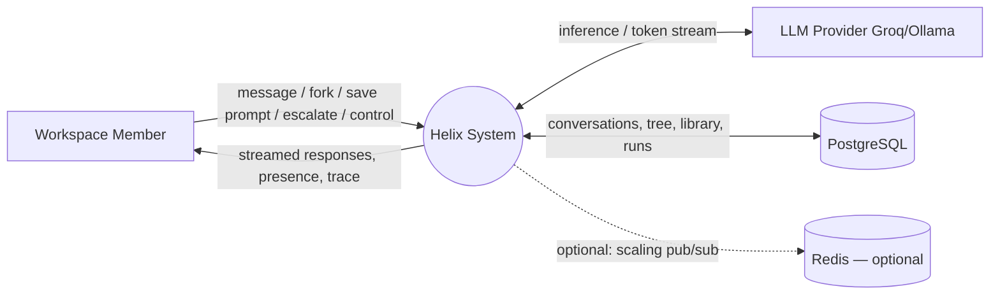
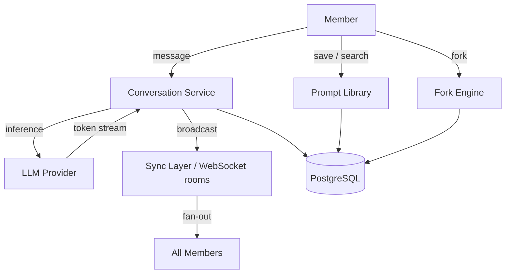
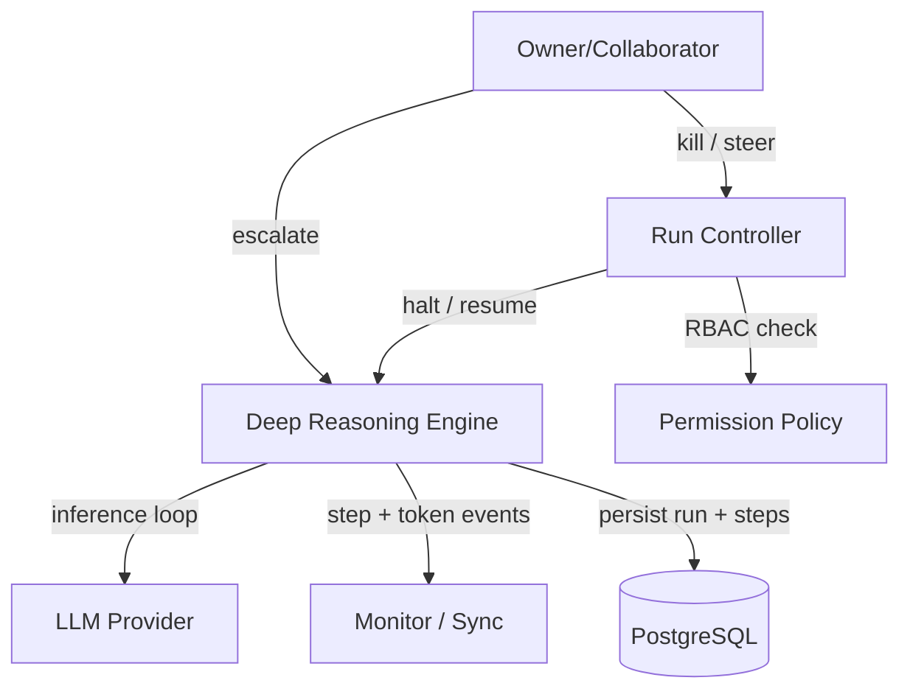
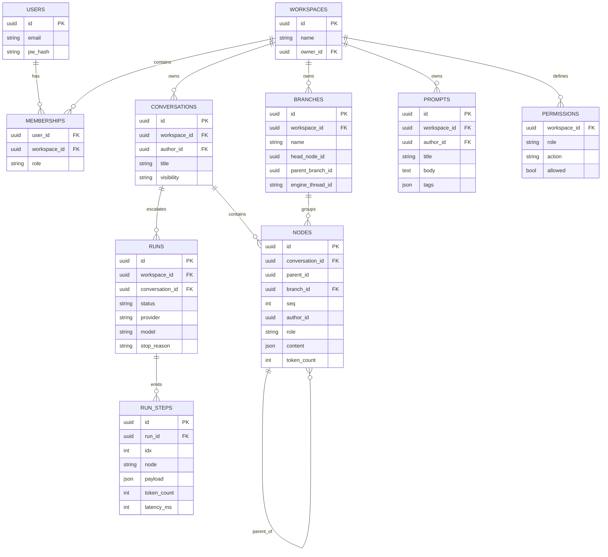
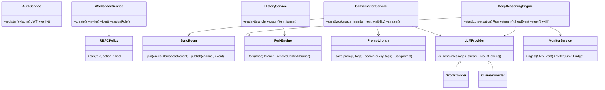

SOFTWARE REQUIREMENTS SPECIFICATION

# Helix: A Multi-Tenant Collaborative AI Workspace with Branchable Conversations and a Monitored Deep-Reasoning Mode

Submitted in partial fulfilment
of the requirements of
Software Project Development

Submitted by:-
 Achindra Sharma 2547105
 Rajnish Kumar 2547143
 M M Mohamed Mansoor 2547132

---

## 1. Introduction

AI tools have become a normal part of how engineering teams, student groups, and
research teams do knowledge work — but they are built for one person in one private
conversation. When a team tries to work with AI together, this design causes
duplicated effort, lost context, and no shared record of what has already been
tried. Helix addresses this by providing a **collaborative AI workspace** in which
a team shares one space: conversations can be shared or private, any thread can be
forked and branched to explore alternatives, prompts that work are saved to a
shared, searchable library, and live updates with presence keep the workspace feeling
shared. For hard, open-ended problems, any conversation can be escalated into a
**Deep Reasoning mode** — a recursive reasoning run that the whole team can watch
live and that is governed by a monitor with a kill switch, a steering/pause control,
and a token-cost budget meter so a long autonomous run never becomes an opaque,
runaway process. The platform is model-agnostic, running on either hosted or local
LLMs.

### 1.1 Purpose

The purpose of Helix is to make a team's AI work shared, reusable, and — when it
becomes ambitious — observable and controllable. The project delivers a multi-tenant
web application covering the everyday collaborative loop (shared and private
conversations, branching, a shared prompt library, real-time presence) and an
escalation path (a monitored recursive deep-reasoning mode), so that teams stop
re-doing each other's work and gain visibility and control over long autonomous AI
runs — all at no per-use cost.

### 1.2 Scope

The Helix project covers a cloud-native web application that functions as a shared
AI workspace. Its principal capabilities are:

**Multi-Tenant Workspaces:** Authenticated accounts, invite-link onboarding, and
roles (Owner / Collaborator / Observer), with every resource scoped to an isolated
workspace tenant.

**Shared & Private Conversations:** Conversations belong to a workspace and are
either shared (visible to members) or private (visible to their author), with
streaming AI responses.

**Branchable Conversations:** Any conversation can be forked at any point into an
independent branch that inherits the parent context but evolves separately,
visualised as a persistent tree.

**Shared Prompt Library:** Reusable prompts saved with tags and search, forming the
team's record of what has been tried and what works.

**Real-Time Collaboration:** WebSocket-based live updates, streaming responses, and
presence signals across all members of a workspace.

**Deep Reasoning Mode:** An escalation in which a conversation is processed by a
recursive reasoning engine (reason → reflect → synthesize, looping to convergence)
rather than a single reply.

**Monitoring & Control:** A live view of a Deep Reasoning run (trace and topology)
with a kill switch, a steer/pause control, a recursion-depth guard, and a token-cost
budget meter with threshold alerts.

**Out of Scope:**
- Native mobile applications; the system is browser-based.
- Multi-instance/horizontal scaling (Redis pub/sub fan-out); the system targets a
  single backend instance with in-memory WebSocket rooms.
- Character-level concurrent co-editing of text (operational transforms / CRDTs);
  shared conversation state is an append-only, server-ordered message log.
- Sandboxed execution of arbitrary side-effecting agent tools; Deep Reasoning tool
  use is restricted to a fixed safe allowlist.
- Automated semantic merging of two branches back into one.

## 2. Project Description

### 2.1 Project Overview

Helix eliminates the isolation of single-user AI tools by making AI work a shared
team resource. It is organised as an **everyday collaborative core** and a **Deep
Reasoning escalation**, on a multi-tenant foundation.

**Everyday core.** Within a workspace, members hold **shared or private
conversations** with streaming AI responses. Any conversation can be **forked** into
an independent branch (a persistent tree), so competing approaches can be explored
without losing context. A **shared prompt library** lets the team save, tag, and
search prompts that work, so nobody re-invents what a colleague already solved.
**Real-time sync and presence** over WebSockets keep the workspace live and shared,
with a single authoritative, ordered conversation state maintained through an
append-only message log.

**Deep Reasoning escalation.** When a question is hard and contested, a member
escalates it. Instead of a single reply, Helix runs a **recursive reasoning engine**
(LangGraph) that reasons, reflects on its own thinking, and synthesises, looping
until it converges or hits a compute budget — emitting a structured step event for
every transition. Because this run is long and autonomous, it is accompanied by a
**monitor**: a live trace and topology, a **kill switch** that halts the run at the
next step, a **steer/pause** control that injects human guidance, a recursion-depth
guard, and a **token-cost budget meter** with alerts.

**Foundation.** Every workspace is an isolated tenant; roles map to permitted
actions through a policy table (RBAC); and all inference runs through a provider
interface with interchangeable backends (Groq, Ollama).

### 2.2 Operating Environment

**Client Side:** Up-to-date web browser (Chrome, Edge, Firefox); frontend built with
React, TypeScript, TailwindCSS, and Vite, communicating over REST and a persistent
WebSocket connection. No special hardware.

**Server Side:** A single Python 3.11 + FastAPI backend — API routing, JWT auth,
RBAC, per-workspace in-memory WebSocket rooms, conversation/branch/library services,
and (imported in-process) the Deep Reasoning engine.

**Database:**
- *PostgreSQL:* users, workspaces, memberships/roles, conversations, the branch tree
  (nodes/branches), prompt library, Deep Reasoning runs and step logs, and the RBAC
  policy table. Tenant isolation via workspace-scoped queries and Row-Level Security.

**AI & Execution:**
- *Deep Reasoning:* LangGraph orchestrates the recursive reasoning loop and its
  checkpoint-based state (the basis for branching a run).
- *LLM Inference:* a provider interface exposes one OpenAI-compatible API over two
  pluggable backends — Groq (hosted) and Ollama (local) — selected by configuration.
- *Infrastructure:* Docker Compose for local development; deployable to any container
  host.

**Optional (scaling only):** Redis publish/subscribe to fan events across multiple
backend instances. Not required for the single-instance system.

## 3. System Requirements

### 3.1 Functional Requirements

**FR-1 (Authentication & Accounts):** The system shall provide registration and login
with hashed credentials and issue JWTs for authenticated access to REST and WebSocket
endpoints.

**FR-2 (Workspaces & Multi-Tenancy):** The system shall allow users to create
workspaces, onboard members via invite links, and scope every resource to a single
isolated workspace tenant such that no data crosses workspace boundaries.

**FR-3 (Role-Based Access Control):** The system shall assign each member a role
(Owner / Collaborator / Observer) and authorise every action (send message, fork,
save/use a library prompt, escalate to Deep Reasoning, steer/kill a run, manage
members) against a role-to-permission policy table.

**FR-4 (Shared & Private Conversations):** The system shall let members create
conversations that are either shared (visible to the workspace) or private (visible
to the author), and shall stream AI responses token-by-token.

**FR-5 (Real-Time Sync & Presence):** The system shall maintain one in-memory
WebSocket room per workspace, broadcasting new messages, streaming tokens, and
presence signals to all connected members, with a single ordered conversation state
maintained through an append-only message log with sequence numbers. (Redis pub/sub
may optionally back the rooms to support multiple backend instances.)

**FR-6 (Conversation Fork & Branch Tree):** The system shall allow any conversation
to be forked at any point into a child branch that inherits the parent context and
evolves independently, persisted as a node in a workspace-scoped branch tree and
visualised as an interactive tree.

**FR-7 (Shared Prompt Library):** The system shall allow members to save prompts to a
workspace-scoped library with tags, search and browse the library, and insert a saved
prompt into a conversation for reuse.

**FR-8 (LLM Provider Abstraction):** The system shall route all inference through a
single provider interface with interchangeable Groq and Ollama backends selectable by
configuration.

**FR-9 (Deep Reasoning Mode):** The system shall allow a member to escalate a
conversation into a Deep Reasoning run, processed by a recursive reasoning engine that
reasons, reflects, and synthesises, looping until convergence or compute budget, and
emitting a structured step event (node, thought, energy, depth, readings, synthesis,
token usage) per transition.

**FR-10 (Deep Reasoning Monitor):** The system shall provide a live dashboard that
consumes a run's step and token events and displays the trace, a reasoning-topology
view, and current energy, depth, and loop-guard values in real time.

**FR-11 (Run Control — Kill & Steer):** The system shall provide an authorised kill
switch that halts a running Deep Reasoning run at the next step boundary, and a
steer control that pauses a run awaiting input and resumes it with injected guidance,
subject to a recursion-depth guard.

**FR-12 (Budget Meter & Guardrails):** The system shall meter token usage and request
rate per workspace, surface them against configurable thresholds with alerts, and bound
run spend through the engine's compute-budget halting controller.

**FR-13 (History, Replay & Export):** The system shall persist conversations and runs,
allow any branch to be replayed step by step, and export a conversation or run as JSON
or Markdown.

**FR-14 (Permission Layer):** The system shall let an Owner restrict which tools a Deep
Reasoning run may invoke (allowlist) and require human approval before high-risk tool
execution, atop the RBAC policy table.

### 3.2 Non-Functional Requirements

**NFR-1 (Performance & Latency):** Real-time events (message broadcast, presence, token
fan-out) shall reach connected clients with a target latency under 200 ms.

**NFR-2 (Multi-Tenancy & Isolation):** The system shall enforce tenant isolation via
workspace-scoped queries and PostgreSQL Row-Level Security.

**NFR-3 (Cost Efficiency):** The system shall bound long-run token spend through the
engine's compute-budget halting controller and a per-workspace budget meter, and shall
run on either hosted (Groq) or local (Ollama) models.

**NFR-4 (Scalability):** The single-instance backend shall serve a workspace with
in-memory rooms; for horizontal scaling, Redis pub/sub may optionally decouple
WebSocket delivery so multiple instances can serve a workspace without session affinity.

**NFR-5 (Security):** All endpoints shall be protected by JWT auth and RBAC; no data
shall cross tenant boundaries; Deep Reasoning tool use shall be limited to a safe
allowlist.

**NFR-6 (Reliability & Interruptibility):** Any Deep Reasoning run shall be haltable at
the next step by the kill switch, with a recursion-depth guard and compute-budget halt
preventing runaway loops, and safe error reporting on failure.

**NFR-7 (Streaming & Backpressure):** A single response stream shall fan out to N
clients without a slow client stalling delivery to others.

**NFR-8 (Privacy):** The system shall collect only data needed to operate; no
biometric, audio, or video data is captured.

**NFR-9 (Portability):** The system shall be fully containerised, and its provider
interface shall allow new LLM backends without changes to application logic.

## 4. System Design

### 4.1 User Interface

#### 4.1.1 The Workspace (Collaboration View)
- **Conversation list:** shared and private conversations in the workspace, with a
  visibility indicator and a "new conversation" action.
- **Conversation view:** the streaming thread with author attribution and ordering;
  a composer; a **Fork** action; a **Deep Reasoning** escalation button.
- **Presence bar:** live avatars of connected members.
- **Branch tree sidebar:** the persistent fork tree (see 4.1.2).

#### 4.1.2 The Branch Tree
- Nodes (fork points), edges (parent→child lineage), the active branch highlighted;
  selecting a node opens that branch; "Fork here" creates a child branch.

#### 4.1.3 The Prompt Library
- A searchable, tag-filterable list of saved prompts; actions to save the current
  prompt, edit tags, and insert a prompt into a conversation.

#### 4.1.4 The Deep Reasoning Monitor
- **Topology:** the engine graph lighting up node-by-node as it runs.
- **Step trace:** structured log of reasoning steps with token usage and latency.
- **Meters:** energy, recursion depth, loop-guard, cumulative tokens, request rate.
- **Controls:** **Kill**, **Steer/Resume**, and (where required) tool **Approve/Deny**,
  enabled by role.

#### 4.1.5 Replay & Export
- Step-by-step playback of any branch; export of a conversation or run as JSON/Markdown.

### 4.2 Database Design

#### 4.2.1 Data Flow Diagram (DFD)

**Fig 1: Level 0 DFD — Context Diagram**

**Fig 2: Level 1 DFD — Everyday Collaboration**

**Fig 3: Level 1 DFD — Deep Reasoning & Control**

#### 4.2.2 Entity Relationship Diagram (ERD)

**Fig 4: Entity Relationship Diagram**

#### 4.2.3 Class Diagram

**Fig 5: Class Diagram**

## 5. Future Enhancements

**Branch merge:** automated reconciliation of two divergent branches into a merged
parent.

**Prompt library intelligence:** suggest relevant saved prompts in context, and detect
near-duplicate conversations to prevent redundant work.

**Provider routing:** intelligent selection among LLM backends by task, rate-limit
headroom, and latency, with automatic failover.

**Real sandboxed tools:** generalise the safe allowlist into isolated containers so Deep
Reasoning can perform real side-effecting operations under approval and monitoring.

**Educational cohort mode:** an instructor view to run a shared session with a cohort,
fork a student's branch, and replay sessions as teaching artefacts.

## Appendix: Glossary & Acronyms

**Branch:** A line of a conversation in the persistent tree, continuable independently.

**Checkpoint:** A serialised snapshot of a Deep Reasoning run's state (LangGraph),
keyed by a thread id; copying it to a new thread underlies branching a run.

**Deep Reasoning Mode:** An escalation in which a conversation is processed by a
recursive reasoning engine (reason → reflect → synthesize) rather than a single reply.

**Fork:** Cloning a conversation node into a child branch that inherits context.

**JWT:** A signed token authenticating access to Helix endpoints.

**LangGraph:** A framework for stateful LLM applications; orchestrates the Deep
Reasoning loop and its checkpointing.

**Multi-Tenancy:** One deployment serving many isolated workspaces, with strict data
isolation.

**Ollama / Groq:** Free-tier LLM inference backends (local / hosted) behind the provider
interface.

**Presence:** Real-time signals of which members are connected to a workspace.

**Prompt Library:** A workspace-scoped, tagged, searchable store of reusable prompts.

**Pub/Sub:** Redis messaging decoupling WebSocket delivery from the response stream.

**RBAC:** Role-based access control mapping roles (Owner / Collaborator / Observer) to
permitted actions via a policy table.

**Workspace:** An isolated tenant holding a team's conversations, branches, prompt
library, runs, members, and permissions.
